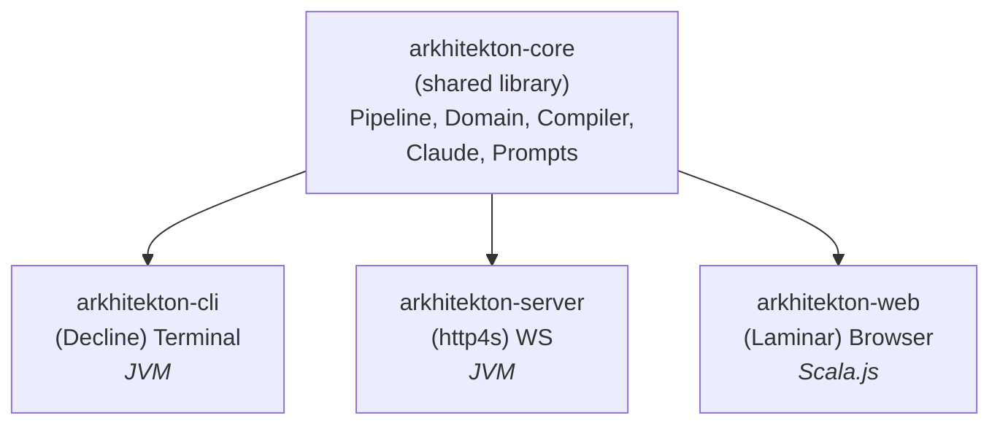

# arkhitekton Studio: Web UI + Core Refactor Plan

## Why

The CLI pipeline works end-to-end (formalize → compile → explain → fill → transpile → test).
But the target users are **SMEs who write English specs**, not developers comfortable in a
terminal. The CLI hit a UX wall: you can't see Idris source and the explanation side-by-side,
progress messages scroll away, copy-pasting answers to typed-hole questions is clunky, and
there's no way to share a session with a colleague.

We're not abandoning the CLI — it remains a first-class tool for developers and CI. We're
adding a web frontend for the SME audience, which requires first decoupling the pipeline
logic from the terminal output.

## Vision

arkhitekton is a round-trip spec verification tool: English specs go in, the Idris 2
compiler checks them, and verified implementations come out with independently generated
tests.

The core pipeline logic is decoupled into a shared library. The CLI remains a first-class
frontend. A new web frontend (Scala.js + Laminar) talks to an http4s backend over
WebSockets. The backend runs on Railway inside a Docker container with Idris 2 + pack.



---

## How the Pipeline Works (Context for Refactoring)

Understanding **what Runner.scala actually does** is essential for the extraction. The
pipeline has two modes:

**Spec iteration (--once / interactive):**
```
readiness → triage → plan modules → decompose → formalize → compile → [autofix] → explain
```
Each step feeds into the next via `Session` (immutable, threaded through with `.copy()`).
The explain step branches on `CompilerOutcome`:
- **Clean** → back-translate to refined English (success path)
- **Holes** → translate typed holes to plain English questions (SME answers, then re-run)
- **Errors** → explain contradictions in domain language (SME fixes spec, then re-run)

**Transpile (--transpile):** runs the spec iteration first, then if clean:
```
fill holes → idris2 --cg node → post-process JS → generate .d.ts + adapter → generate tests → vitest
```

**Single step (--step X):** runs one step in isolation, loading prior state from the
workdir via `ensurePriorStep`. This is how you resume after editing files manually.

**Key data flow:** Pipeline functions (Pipeline.formalize, Pipeline.compile, etc.) return
typed values: `IO[(SomeResult, Session)]`. Runner currently receives these values and
*immediately prints them*. The refactoring separates receiving from printing by routing
output through the Presenter.

---

## Current State (What Exists)

Package: `dev.sibylsystems.speccheck`

| File | Role | Coupling |
|------|------|----------|
| Domain.scala | Pure ADTs (Session, CompilerResult, etc.) | None |
| Pipeline.scala | Core algorithm steps, returns typed values | Low (IO only) |
| Prompts.scala | Pure prompt construction | None |
| Compiler.scala | idris2 subprocess wrapper | os-lib |
| Claude.scala | LLM backend trait + implementations | Low |
| References.scala | Tool definitions + reference resolver | None |
| Metrics.scala | Timing utilities | None |
| Models.scala | Model resolution | None |
| Terminal.scala | ANSI formatting helpers | None |
| StateIO.scala | Session serialization to disk | os-lib |
| PostProcess.scala | JS export injection | os-lib |
| TestRunner.scala | vitest execution | os-lib |
| Readiness.scala | Spec readiness gate | Low |
| Triage.scala | Section classification | Low |
| Decompose.scala | Definition extraction | Low |
| ModulePlanner.scala | Multi-module planning | Low |
| **Runner.scala** | **Orchestration + 60+ IO.println calls** | **High** |
| **Main.scala** | **CLI entry point (decline)** | **CLI-specific** |
| CliBackends.scala | CLI-specific backend wrappers | CLI-specific |

**Key insight:** Everything except Runner.scala, Main.scala, and CliBackends.scala is
already close to decoupled. Runner.scala is the main refactoring target — it interleaves
orchestration logic with terminal output.

---

## Phase 1: Core Extraction

**Goal:** Split the monolith into `core` / `cli` sbt subprojects. No new features.
The CLI must work identically after this phase.

### 1.1 sbt Multi-Project Build

```
build.sbt
modules/
  core/
    src/main/scala/dev/sibylsystems/speccheck/core/
  cli/
    src/main/scala/dev/sibylsystems/speccheck/cli/
  server/     (Phase 3)
  web/        (Phase 4)
```

```scala
// build.sbt
lazy val core = (project in file("modules/core"))
  .settings(
    name := "arkhitekton-core",
    libraryDependencies ++= Seq(
      // cats-effect, circe, sttp, os-lib — everything the pipeline needs
    ),
  )

lazy val cli = (project in file("modules/cli"))
  .dependsOn(core)
  .settings(
    name := "arkhitekton-cli",
    libraryDependencies ++= Seq(
      // decline, decline-effect — CLI-only
    ),
    assembly / mainClass := Some("dev.sibylsystems.speccheck.cli.Main"),
  )
```

### 1.2 Presenter Trait

The central abstraction that decouples orchestration from UI:

```scala
// core — Presenter.scala
trait Presenter[F[_]]:
  /** Pipeline step started. */
  def stepStarted(step: String): F[Unit]

  /** Inline progress message (e.g., "Translating spec..."). */
  def progress(step: String, message: String): F[Unit]

  /** Step completed with timing. */
  def stepCompleted(step: String, timing: StepTiming): F[Unit]

  /** Step failed. */
  def stepFailed(step: String, error: String): F[Unit]

  /** An artifact was produced (Idris source, compiler output, etc.). */
  def artifact(kind: ArtifactKind, name: String, content: String): F[Unit]

  /** Pipeline produced questions (typed holes → English). Collect answers. */
  def askQuestions(questions: List[String]): F[Option[List[String]]]

  /** Pipeline produced a final result (back-translation, error explanation). */
  def result(title: String, outcome: CompilerOutcome, explanation: String): F[Unit]

  /** Informational message (next steps, summaries). */
  def info(message: String): F[Unit]

enum ArtifactKind:
  case IdrisSource, CompilerOutput, RefinedSpec, JavaScript,
       TypeDefinitions, Adapter, TestFile, TestOutput, Manifest, Triage
```

### 1.3 Extract Orchestrator from Runner.scala

This is the hardest step. Runner.scala currently has **three interleaved concerns**:

1. **Orchestration** — `oneIteration`, `continueIteration`, `singleStep`, `ensurePriorStep`.
   This is the pipeline's control flow: which steps run, in what order, with what retry
   logic. This belongs in core.

2. **Presentation** — 60+ `IO.println` calls, `Terminal.*` formatting, `header()`,
   `divider`, `printReadinessResult`, `printNextSteps`. This belongs behind the Presenter
   trait.

3. **Interaction** — `menu()`, `collectAnswers()`, `readLines()`. These use
   `StdIn.readLine()` which is synchronous/blocking. In the web UI, the equivalent is
   async: send questions over WebSocket, wait on a `Deferred[IO, List[String]]` that
   completes when the client sends `SubmitAnswers`. **The Presenter.askQuestions method
   abstracts over this difference** — CLI blocks on stdin, web blocks on a Deferred.

4. **Diagnostic logging** — `log()` writes intermediate outputs to `workDir/logs/`.
   This is useful for both CLI and web, so it stays in Orchestrator (core), not Presenter.

5. **State recovery** — `ensurePriorStep()` loads prior step results from disk so you
   can resume from `--workdir`. This is core logic, not CLI-specific.

**The `singleStep` method** deserves special attention. It implements `--step readiness`,
`--step triage`, `--step formalize`, `--step compile`, `--step autofix`, `--step explain`,
and `--step back-translate`. Each step loads prior state via `ensurePriorStep`, runs one
pipeline step, and prints results. In the web UI this maps to `ClientCommand.RunSingleStep`.
The orchestration logic moves to core; the output goes through Presenter.

Move the orchestration into `Orchestrator.scala` in core:

```scala
// core — Orchestrator.scala
object Orchestrator:
  def oneIteration(
    session: Session,
    backend: LlmBackend,
    model: String,
    idris2: String,
    presenter: Presenter[IO],
  ): IO[Session] = ...

  def transpile(
    session: Session,
    backend: LlmBackend,
    model: String,
    idris2: String,
    presenter: Presenter[IO],
  ): IO[(Session, TestResult)] = ...

  def singleStep(
    step: String,
    session: Session,
    backend: LlmBackend,
    model: String,
    idris2: String,
    presenter: Presenter[IO],
  ): IO[(Session, ExitCode)] = ...

  /** Load prior state from workdir. Core logic — both CLI and web need this. */
  private def ensurePriorStep(session: Session, priorStep: String): IO[Session] = ...

  /** Write diagnostic logs to workDir/logs/. Core — not presentation. */
  private def log(workDir: os.Path, name: String, content: String): IO[Unit] = ...
```

### 1.4 CLI Presenter

```scala
// cli — CliPresenter.scala
class CliPresenter extends Presenter[IO]:
  // stepStarted   → IO.print("  Doing X...")
  // stepCompleted → IO.println(" done ✓")
  // artifact      → log to workdir (already happens in Orchestrator, so often no-op)
  // askQuestions  → prints questions, reads StdIn.readLine(), returns answers
  // result        → IO.println(header("Refined Spec")) *> IO.println(explanation)
  // info          → IO.println(message)
```

The key contract: `askQuestions` blocks on `StdIn.readLine` and returns `Some(answers)`
or `None` (user quit). In the web Presenter, this same method sends a `QuestionsReady`
event and blocks on a `Deferred` until the client sends `SubmitAnswers`.

### 1.5 Slim Down Runner.scala

Runner.scala becomes a thin wrapper that constructs a `CliPresenter` and delegates to
`Orchestrator`:

```scala
// cli — Runner.scala (simplified)
object Runner:
  def once(session: Session, backend: LlmBackend, model: String, idris2: String): IO[ExitCode] =
    val presenter = CliPresenter()
    Orchestrator.oneIteration(session, backend, model, idris2, presenter).as(ExitCode.Success)

  def interactive(session: Session, backend: LlmBackend, model: String, idris2: String): IO[ExitCode] =
    val presenter = CliPresenter()
    // The loop lives here (CLI-specific), but each iteration delegates to Orchestrator.
    // askQuestions returning None means "quit" → exit the loop.
    def loop(s: Session): IO[ExitCode] =
      Orchestrator.oneIteration(s, backend, model, idris2, presenter).flatMap { updated =>
        if updated.lastResult.exists(_.outcome == CompilerOutcome.Clean) then
          IO.pure(ExitCode.Success)
        else
          presenter.askQuestions(/* holes */).flatMap {
            case Some(answers) => loop(updated.withAnswers(answers))
            case None          => IO.pure(ExitCode.Success)
          }
      }
    loop(session)
```

**Note:** The interactive loop stays in CLI Runner because the web UI drives iteration
differently (user clicks "Submit & Re-run" which sends a new `StartAnalysis` command).
Only the single-iteration logic is shared.

### 1.6 Resources

`src/main/resources/` contains prompt templates (`.md` files used by Prompts.scala) and
reference docs (loaded on-demand by References.scala via the `get_reference` tool). These
are core — they move to `modules/core/src/main/resources/`. The CLI has no resource files
of its own.

There are also two new prompt files (`decompose-system.md`, `decompose-user.md`) and a
new `Decompose.scala` that were added on the `ADD-parallelize_workflow` branch. These are
part of the multi-module parallel formalization work and should move to core along with
everything else.

### 1.7 File Moves

| Current location | New location | Subproject |
|-----------------|--------------|------------|
| Domain.scala | `core/` | core |
| Pipeline.scala | `core/` | core |
| Prompts.scala | `core/` | core |
| Compiler.scala | `core/` | core |
| Claude.scala | `core/` | core |
| References.scala | `core/` | core |
| Metrics.scala | `core/` | core |
| Models.scala | `core/` | core |
| StateIO.scala | `core/` | core |
| PostProcess.scala | `core/` | core |
| TestRunner.scala | `core/` | core |
| Readiness.scala | `core/` | core |
| Triage.scala | `core/` | core |
| Decompose.scala | `core/` | core |
| ModulePlanner.scala | `core/` | core |
| **Orchestrator.scala** | `core/` (new) | core |
| **Presenter.scala** | `core/` (new) | core |
| Terminal.scala | `cli/` | cli |
| Main.scala | `cli/` | cli |
| CliBackends.scala | `cli/` | cli |
| **CliPresenter.scala** | `cli/` (new) | cli |
| Runner.scala | `cli/` (slimmed) | cli |

### 1.8 Traps and Pitfalls

**Don't over-abstract the Presenter.** The trait should have ~8 methods (the ones listed
in 1.2), not 30. If you find yourself adding a method for every nuance of CLI formatting,
you're pushing presentation logic into the trait. The Presenter communicates *what happened*
(step started, artifact ready, questions); the implementation decides *how to show it*.

**Don't change the pipeline logic.** Phase 1 is a pure refactor. Every `Pipeline.*` call,
every `Compiler.*` call, every `Readiness.*` / `Triage.*` / `Decompose.*` call stays
exactly as-is. The only thing that changes is *who calls them* (Orchestrator instead of
Runner) and *where output goes* (Presenter instead of IO.println).

**The interactive loop is CLI-specific.** Don't try to put the `loop` / `menu` / retry
logic into Orchestrator. The web UI drives iteration via discrete WebSocket commands.
Orchestrator exposes single-iteration and single-step primitives; the CLI and web each
build their own loop on top.

**`os.Path` in Domain types.** Session, TranspileResult, and TestResult use `os.Path`.
This is fine — these types don't cross-compile to JS. Only the `protocol` module's event
types need to be JS-compatible (they use `String` for paths).

### 1.9 Verification

- [ ] `sbt cli/compile` succeeds
- [ ] `sbt cli/assembly` produces a working fat JAR
- [ ] `arkhitekton examples/crucible_spec_v2.md --once` produces identical output
- [ ] `arkhitekton examples/crucible_spec_v2.md --transpile` still works
- [ ] All existing munit tests pass (`sbt cli/test`)

---

## Phase 2: WebSocket Event Protocol

**Goal:** Define the shared protocol between server and web client. This is
cross-compiled to JVM + JS so both sides share the same types.

### 2.1 Shared Protocol Module

```scala
// build.sbt addition
lazy val protocol = crossProject(JVMPlatform, JSPlatform)
  .crossType(CrossType.Pure)
  .in(file("modules/protocol"))
  .settings(
    name := "arkhitekton-protocol",
    libraryDependencies ++= Seq(
      "io.circe" %%% "circe-core"    % circeVersion,
      "io.circe" %%% "circe-generic" % circeVersion,
      "io.circe" %%% "circe-parser"  % circeVersion,
    ),
  )
```

### 2.2 Event Types

```scala
// protocol — Events.scala
// Server → Client
enum PipelineEvent derives Codec.AsObject:
  case StepStarted(step: String, label: String)
  case StepProgress(step: String, message: String)
  case StepCompleted(step: String, durationMs: Long)
  case StepFailed(step: String, error: String)
  case ArtifactReady(kind: String, name: String, content: String)
  case QuestionsReady(questions: List[String])
  case ResultReady(outcome: String, title: String, explanation: String)
  case TestsCompleted(passed: Int, failed: Int, output: String)
  case SessionMetrics(timings: List[TimingEntry])
  case Error(message: String)

// Client → Server
enum ClientCommand derives Codec.AsObject:
  case StartAnalysis(spec: String, mode: AnalysisMode)
  case SubmitAnswers(answers: List[String])
  case RunTranspile
  case RunAutoFix
  case RunSingleStep(step: String)
  case CancelRun

enum AnalysisMode:
  case Once, Interactive, Transpile

case class TimingEntry(step: String, durationMs: Long)
```

### 2.3 WebPresenter

```scala
// server — WebPresenter.scala
class WebPresenter(send: PipelineEvent => IO[Unit]) extends Presenter[IO]:
  def stepStarted(step: String): IO[Unit] =
    send(PipelineEvent.StepStarted(step, step))

  def askQuestions(questions: List[String]): IO[Option[List[String]]] =
    // Send questions to client, then wait on a Deferred[IO, List[String]]
    // that the WebSocket handler completes when SubmitAnswers arrives
    ...
```

This is where the `Presenter` trait pays off — the same `Orchestrator.oneIteration`
drives both the CLI and the web UI, just with different `Presenter` implementations.

---

## Phase 3: HTTP Server

**Goal:** An http4s server that exposes the pipeline over WebSockets.

### 3.1 Server Subproject

```scala
lazy val server = (project in file("modules/server"))
  .dependsOn(core, protocol.jvm)
  .settings(
    name := "arkhitekton-server",
    libraryDependencies ++= Seq(
      "org.http4s" %% "http4s-ember-server" % http4sVersion,
      "org.http4s" %% "http4s-dsl"          % http4sVersion,
    ),
  )
```

### 3.2 Routes

```
GET  /                           → serves the Scala.js SPA (static files)
GET  /ws                         → WebSocket upgrade → pipeline event stream
GET  /api/health                 → health check (idris2 --version)
GET  /api/sessions/:id/artifacts → download artifacts from a completed session
```

### 3.3 WebSocket Handler

```scala
// server — WebSocketHandler.scala
object WebSocketHandler:
  def apply(
    backend: LlmBackend,
    model: String,
    idris2: String,
  ): HttpRoutes[IO] =
    // 1. On connect: create a session, create a WebPresenter backed by the WS send queue
    // 2. On ClientCommand.StartAnalysis: launch Orchestrator.oneIteration on a Fiber
    // 3. On ClientCommand.SubmitAnswers: complete the Deferred in WebPresenter
    // 4. On ClientCommand.CancelRun: cancel the Fiber
    // 5. On disconnect: clean up session working directory (or keep for N hours)
    ...
```

### 3.4 Session Management

- Each WebSocket connection gets a server-side `Session` + work directory.
- Work directories stored under `/data/sessions/<uuid>/` (Railway volume mount).
- Background cleanup job removes sessions older than 24 hours.
- No auth for v1 — Railway service is access-controlled at the network level.

### 3.5 Verification

- [ ] `sbt server/run` starts and accepts WebSocket connections
- [ ] `wscat -c ws://localhost:8080/ws` + send `StartAnalysis` → receives pipeline events
- [ ] Full iteration loop works over WebSocket (start → questions → answers → result)
- [ ] Health endpoint returns idris2 version

---

## Phase 4: Web Frontend (Laminar)

**Goal:** A Scala.js SPA that provides the three-panel UI.

### 4.1 Web Subproject

```scala
lazy val web = (project in file("modules/web"))
  .enablePlugins(ScalaJSPlugin)
  .dependsOn(protocol.js)
  .settings(
    name := "arkhitekton-web",
    scalaJSUseMainModuleInitializer := true,
    libraryDependencies ++= Seq(
      "com.raquo" %%% "laminar"  % laminarVersion,
      "com.raquo" %%% "waypoint" % waypointVersion,  // routing (optional)
    ),
  )
```

### 4.2 UI Layout — Three-Panel Design

```
┌─────────────────────────────────────────────────────────────┐
│  arkhitekton studio                          [session: abc]  │
├────────────┬──────────────────────────┬─────────────────────┤
│            │                          │                     │
│  TIMELINE  │     MAIN PANEL           │   ARTIFACT PANEL    │
│            │                          │                     │
│  ○ Ready   │  (context-sensitive —    │  (tabs: Spec,       │
│  ● Triage  │   editor, progress,      │   Idris, Compiler,  │
│  ○ Plan    │   questions, or results) │   Refined, JS,      │
│  ○ Formal  │                          │   Types, Tests,     │
│  ○ Compile │                          │   Results)          │
│  ○ Explain │                          │                     │
│  ┈┈┈┈┈┈┈┈  │                          │                     │
│  ○ Fill    │                          │                     │
│  ○ JS      │                          │                     │
│  ○ Tests   │                          │                     │
│  ○ Run     │                          │                     │
│            │                          │                     │
├────────────┴──────────────────────────┴─────────────────────┤
│  Readiness ✓ 1.2s │ Triage ✓ 0.8s │ Formalize ⏳ 12.3s... │
└─────────────────────────────────────────────────────────────┘
```

### 4.3 Timeline Panel (Left, ~150px)

Vertical stepper showing pipeline stages. Each node has one of four states:

| State | Visual | Meaning |
|-------|--------|---------|
| Pending | `○` dim | Not yet reached |
| Running | `◉` pulse | Currently executing |
| Done | `●` green | Completed successfully |
| Failed | `●` amber/red | Completed with issues |

Dashed separator divides the **spec iteration loop** (readiness → explain) from
the **transpile pipeline** (fill → run). Clicking a completed node loads its
artifact in the right panel.

### 4.4 Main Panel (Center, Flexible Width)

Four modes, driven by pipeline state:

**Editor mode** — Start state or between iterations.
- Markdown-aware textarea for the English spec.
- "Analyze" button launches the pipeline.
- Drag-and-drop for `.spec.md` files.

**Progress mode** — While pipeline steps are running.
- Step label + streaming log of progress messages.
- Maps directly to `PipelineEvent.StepProgress`.
- No interaction — watch and wait.

**Questions mode** — When compiler finds typed holes.
- Numbered list of LLM-translated questions.
- Text input field below each question.
- "Submit Answers & Re-run" button.
- Maps to `PipelineEvent.QuestionsReady` → `ClientCommand.SubmitAnswers`.

**Results mode** — When spec compiles clean.
- Back-translated refined spec with diff view against original.
- Two actions: "Iterate Again" (back to editor) or "Transpile" (launch steps 7-10).

### 4.5 Artifact Panel (Right, ~35% Width, Collapsible)

Tabbed view of generated artifacts. Tabs appear dynamically as `ArtifactReady`
events arrive:

| Tab | ArtifactKind | Content |
|-----|-------------|---------|
| Spec | — | Original English spec (always present) |
| Idris | IdrisSource | Generated `.idr` with syntax highlighting |
| Compiler | CompilerOutput | Raw compiler output |
| Refined | RefinedSpec | Back-translated English |
| JS | JavaScript | Compiled JavaScript |
| Types | TypeDefinitions | `.d.ts` + adapter |
| Tests | TestFile | Generated `.test.ts` |
| Results | TestOutput | vitest pass/fail output |

Multi-module specs: Idris tab gets sub-tabs per module.

### 4.6 Metrics Bar (Bottom)

Horizontal strip of `StepTiming` entries. Active step shows elapsed timer animation.
Maps to `PipelineEvent.SessionMetrics`.

### 4.7 State Management

```scala
// web — AppState.scala
case class AppState(
  mode: UIMode,                              // Editor | Progress | Questions | Results
  timeline: List[TimelineNode],              // step states
  artifacts: Map[String, String],            // kind → content
  questions: List[String],                   // pending questions
  metrics: List[TimingEntry],                // completed step timings
  activeStep: Option[String],                // currently running step
  spec: String,                              // current spec text
)

enum UIMode:
  case Editor, Progress, Questions, Results
```

All state lives in a `Var[AppState]`. The WebSocket `EventStream[PipelineEvent]`
drives state transitions via `fold`:

```scala
events.foldLeft(AppState.initial) { (state, event) =>
  event match
    case StepStarted(step, _)      => state.withActiveStep(step)
    case StepCompleted(step, ms)   => state.completeStep(step, ms)
    case ArtifactReady(kind, _, c) => state.withArtifact(kind, c)
    case QuestionsReady(qs)        => state.copy(mode = Questions, questions = qs)
    case ResultReady(_, _, expl)   => state.copy(mode = Results, ...)
    ...
}
```

### 4.8 Visual Design

- **Tone:** Technical/professional. GitHub Actions or Vercel deploy logs aesthetic.
- **Color:** Dark sidebar (timeline), light main area. Green/amber/red for pipeline states.
- **Typography:** Monospace for code artifacts, system font for UI chrome.
- **Responsive:** On narrow screens, timeline collapses to top bar, artifact panel
  becomes a bottom drawer. Optimized for desktop (SMEs working on specs).

### 4.9 Verification

- [ ] `sbt web/fastLinkJS` produces a working SPA
- [ ] Editor mode → type spec → click Analyze → see progress in timeline
- [ ] Questions mode renders hole-derived questions with input fields
- [ ] Results mode shows refined spec with Iterate / Transpile actions
- [ ] Artifact tabs populate as events arrive
- [ ] Full iteration loop: spec → questions → answers → refined spec

---

## Phase 5: Docker + Railway Deployment

**Goal:** Containerize the server (with Idris 2 + pack + Node.js) and deploy to Railway.

### 5.1 Docker Image

Base image: `ghcr.io/joshuanianji/idris-2-docker/devcontainer:latest`
- Includes Idris 2 + pack (multi-arch: amd64 + arm64)
- We layer JDK 21 + Node.js on top

```dockerfile
# Stage 1: Build the Scala app
FROM eclipse-temurin:21-jdk AS builder
WORKDIR /build
COPY . .
RUN sbt server/assembly

# Stage 2: Runtime with Idris 2 + JDK + Node
FROM ghcr.io/joshuanianji/idris-2-docker/devcontainer:latest AS runtime

# Add JDK 21 (headless)
RUN apt-get update && apt-get install -y --no-install-recommends \
    openjdk-21-jre-headless \
    nodejs npm \
    && rm -rf /var/lib/apt/lists/*

# Pre-install elab-util (needed by most specs)
RUN pack install elab-util

WORKDIR /app
COPY --from=builder /build/modules/server/target/scala-*/arkhitekton-server-assembly-*.jar app.jar

# Serve the Scala.js frontend as static files
COPY --from=builder /build/modules/web/target/scala-*/arkhitekton-web-opt/ /app/static/

ENV PORT=8080
ENV JAVA_OPTS="-Xmx512m -XX:MaxRAMPercentage=75"
EXPOSE 8080

CMD ["java", "-jar", "app.jar"]
```

**Image size estimate:** ~800MB–1GB (Idris 2 + pack ecosystem is large).
Multi-stage build keeps the builder layer out of the final image.

**Alternative:** If the devcontainer base image is too heavy, build a slimmer image
using the `stefan-hoeck/idris2-pack` Dockerfile as a reference and only install
what we need (idris2, pack, elab-util, node backend).

### 5.2 Railway Configuration

```toml
# railway.toml
[build]
builder = "dockerfile"
dockerfilePath = "Dockerfile"

[deploy]
startCommand = "java $JAVA_OPTS -jar app.jar"
healthcheckPath = "/api/health"
healthcheckTimeout = 30
restartPolicyType = "on_failure"
```

**Environment variables (set in Railway dashboard):**
- `ANTHROPIC_API_KEY` — required
- `PORT` — Railway sets this automatically
- `JAVA_OPTS` — `-Xmx512m` (tune to Railway plan memory)

**Volume mount:**
- Mount path: `/data`
- Used for: session working directories (`/data/sessions/<uuid>/`)
- Size: 1 GB (sufficient for many concurrent sessions)

### 5.3 Railway Plan Assessment

| Concern | Assessment |
|---------|-----------|
| Long-running processes (30-60s+) | Supported — Railway runs containers, no request timeout |
| WebSocket | Supported — Railway proxy handles WS upgrade |
| Custom Dockerfile | Supported — builder = "dockerfile" |
| Persistent volume | Supported — for session artifacts |
| Sleep/wake on Hobby plan | Container sleeps after idle; JVM cold start ~10-15s |
| Memory (JVM + Idris 2) | ~512MB JVM + ~256MB for idris2 compilation; stay under 1GB |
| Cost | Hobby plan $5/mo; usage-based beyond included credit |

### 5.4 Verification

- [ ] `docker build -t arkhitekton-studio .` succeeds
- [ ] `docker run -p 8080:8080 -e ANTHROPIC_API_KEY=... arkhitekton-studio` starts
- [ ] `idris2 --version` works inside the container
- [ ] `pack --version` works inside the container
- [ ] Full pipeline works inside the container (spec → formalize → compile → tests)
- [ ] `railway up` deploys successfully
- [ ] Health check passes on Railway
- [ ] WebSocket connection works through Railway's proxy

---

## Phase 6: Hardening

**Goal:** Production-readiness improvements that apply to both CLI and web.

### 6.1 Pipeline Reliability
- [ ] Retry logic for the formalize step (currently only fill-holes retries)
- [ ] Prompt caching for system prompts across API calls (Anthropic cache_control)
- [ ] Graceful cancellation — Fiber.cancel propagates to LLM API calls
- [ ] Better error messages when test generation produces invalid TS

### 6.2 Web-Specific
- [ ] Session persistence across server restarts (serialize to volume)
- [ ] Rate limiting per IP (prevent abuse on public deployment)
- [ ] Basic auth or shared-secret gate (not full user management)
- [ ] Connection recovery — auto-reconnect WebSocket with state replay

### 6.3 CI / CD
- [ ] GitHub Actions: build + test on PR
- [ ] GitHub Actions: build Docker image on merge to main
- [ ] Railway auto-deploy from main branch
- [ ] CI-friendly exit codes for CLI (0 = pass, 1 = test fail, 2 = pipeline error)

### 6.4 Testing
- [ ] Core: munit tests for Orchestrator with a mock Presenter
- [ ] Protocol: round-trip serialization tests for all PipelineEvent / ClientCommand variants
- [ ] Server: integration test — WebSocket client drives a full pipeline
- [ ] Web: basic Laminar component tests (optional — manual testing is fine for v1)

---

## Execution Order

```
Phase 1 ─── Core extraction + Presenter trait ─── ~2-3 days
   │        (pure refactor, CLI stays identical)
   │
Phase 2 ─── WebSocket protocol ─── ~1 day
   │        (cross-compiled types, no runtime yet)
   │
Phase 3 ─── HTTP server ─── ~2 days
   │        (http4s + WS handler + WebPresenter)
   │
Phase 4 ─── Laminar frontend ─── ~3-4 days
   │        (three-panel UI, all four modes)
   │
Phase 5 ─── Docker + Railway ─── ~1-2 days
   │        (containerize, deploy, verify)
   │
Phase 6 ─── Hardening ─── ongoing
            (reliability, auth, CI/CD)
```

Phases 1-2 are prerequisites. Phases 3 and 4 can overlap (server API stabilizes
quickly, frontend iterates against it). Phase 5 can start as soon as Phase 3 has
a working health endpoint.

---

## Key Design Decisions

### Why Presenter trait, not event sourcing
The `Presenter[F[_]]` trait is simpler than a full event-sourced architecture.
The CLI calls `IO.println`; the web emits WebSocket events. Same orchestration code,
different output channel. No need for event replay, projections, or a store.

### Why Laminar over Tyrian/Calico
Laminar is the most mature Scala.js UI library. Its reactive signal model maps
naturally to streaming WebSocket events. Tyrian (Elm architecture) would also work
but adds more boilerplate for the same result. Calico is too young.

### Why Railway over Fly.io
Railway has simpler DX (no flyctl, no Machines API), native Dockerfile support,
built-in volumes, and a $5/mo hobby plan that covers our needs. Fly.io gives more
control but we don't need it yet. Migration to Fly is straightforward if we outgrow
Railway (it's just a Docker container).

### Why not cross-compile core to JS
Only the `protocol` module needs to cross-compile. The core pipeline shells out to
`idris2` and runs subprocesses — fundamentally JVM-only. The web frontend is a thin
client; it doesn't run pipeline logic. Forcing cross-compilation on core would mean
abstracting away os-lib, subprocess execution, and file I/O for no benefit.

### Why not SSE instead of WebSockets
The pipeline is bidirectional: the server sends events, but the client also sends
commands (submit answers, cancel, run transpile). SSE is server→client only; we'd
need a separate POST endpoint for commands. WebSockets are simpler for bidirectional
communication and http4s has good WS support.

---

## Open Questions

1. **Syntax highlighting in the browser.** Use highlight.js for Idris (closest match:
   Haskell grammar) and TypeScript? Or a lighter approach like Prism.js?

2. **Diff view for refined spec.** Inline diff (like GitHub) or side-by-side?
   Could use jsdiff via Scala.js facade or a purpose-built Laminar component.

3. **Multiple concurrent sessions.** v1 is single-session per WebSocket connection.
   Should we support multiple named sessions in the UI? Probably not for v1.

4. **Spec file upload vs paste.** Start with paste-only. File upload (drag-and-drop)
   is a nice-to-have for Phase 4 but not blocking.

5. **Idris 2 version pinning.** The devcontainer image tracks nightly. Should we pin
   to a specific version (0.8.0) for reproducibility? Yes — match the version in
   MISSING_MANUAL.md.
