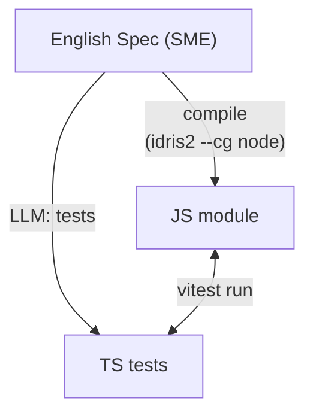
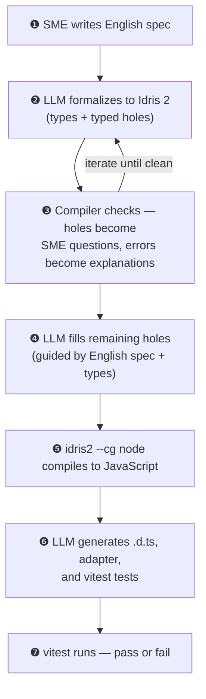

# Arkhitekton

A round-trip specification iteration tool. English specs go in, the Idris 2
compiler checks them, and verified implementations come out — with independently
generated tests.

## The Problem

When an LLM writes code AND writes tests for that code, it grades its own
homework. Misunderstandings are self-consistent. Tests pass because the LLM
is consistent with itself, not because the code matches your intent.

## The Solution

A triangle with three independent vertices:



- **Left leg** (spec → JS): mechanical. `idris2 --cg node` compiles the spec
  to JavaScript. No LLM in this path.
- **Right leg** (spec → tests): LLM generates TypeScript tests from the English
  spec and the Idris types. It never sees the JS implementation.
- **Bottom**: `vitest` runs the tests against the compiled JS. If they agree,
  the spec is correct. If they disagree, the spec arbitrates.

The Idris 2 compiler is the mechanical referee — the only participant that is
neither human nor LLM.

## The Pipeline



Steps ❶–❸ are the **spec iteration loop**: the SME refines their spec based on
compiler-generated questions until it compiles clean.

Steps ❹–❼ are the **transpile pipeline**: the verified spec becomes a working
JavaScript module with independently generated tests.

## Quick Start

### Prerequisites

- Java 17+
- `idris2` compiler (install via [pack](https://github.com/stefan-hoeck/idris2-pack))
- Node.js (for running generated tests)
- Anthropic API key

### Install

```bash
# Build and install locally (requires sbt)
./scripts/install.sh --local
```

Set your API key:

```bash
export ANTHROPIC_API_KEY=sk-ant-...
# Or add to ~/.bashrc / ~/.zshrc
```

### Usage

```bash
# Interactive spec iteration (the core loop)
arkhitekton examples/crucible_spec_v2.md

# Single pass — formalize, check, explain
arkhitekton examples/crucible_spec_v2.md --once

# Full transpile pipeline — formalize → compile → fill → JS → tests → run
arkhitekton examples/crucible_spec_v2.md --transpile

# Show all options
arkhitekton --help
```

### Build from Source

If you prefer to build locally (requires `sbt`):

```bash
git clone https://github.com/sibyl-systems/arkhitekton.git
cd arkhitekton
echo "ANTHROPIC_API_KEY=sk-ant-..." > .env
sbt assembly
# Run directly
java -jar target/scala-3.7.1/arkhitekton-assembly-*.jar examples/crucible_spec_v2.md
```

### Example Output (--transpile)

```
❶ Formalizing spec into Idris 2...
❷ Compiling... Compiles clean — no holes, no errors.
❸ Back-translating to refined English...
❹ Filling typed holes... Holes filled, compiles clean.
❺ JS: spec.js (10 exports: weight, itemDefault, calculateScore, ...)
❻ Types: spec.d.ts | Adapter: spec-adapter.ts | Tests: spec.test.ts
❼ Running tests...
 ✓ weight(High) = 0.3
 ✓ weight(Medium) = 0.25
 ✓ all priority weights sum to 1.0
 ✓ uses default when value is missing
 ✓ score is capped at 1.0
 ✓ high-priority item scores higher than low-priority item
 ✓ total score equals sum of weighted contributions
   ...
 Tests: 31 passed (31)
```

## How It Works

### Spec Iteration (Steps ❶–❸)

The SME writes a plain English spec — the kind they'd naturally produce.
An LLM translates it to Idris 2 types and signatures. The compiler responds
in one of three ways:

- **Typed holes**: the spec is underspecified. The compiler names every gap and
  constrains what valid answers look like. The LLM translates these to plain
  English questions for the SME.
- **Type errors**: the spec contradicts itself. The LLM explains the contradiction
  in domain language ("a raw value of 50000.0 is not a 0–1 score").
- **Clean**: the spec is consistent. The LLM back-translates the Idris to a
  refined English spec that's sharper than what went in.

The SME reads and writes English throughout. Nobody needs to know Idris.

### Transpile Pipeline (Steps ❹–❼)

Once the spec compiles clean, Idris 2 is both the spec AND the implementation:

1. The LLM fills any remaining typed holes (guided by the English spec for intent
   and the types for structure). The compiler re-checks.
2. `idris2 --cg node` compiles to JavaScript. `%export` directives prevent
   dead-code elimination and create clean function names.
3. The LLM generates TypeScript type definitions and an adapter layer that
   converts between Idris JS representations and idiomatic TypeScript.
4. The LLM generates vitest tests from both the English spec (intent) and
   the Idris types (structure). It never sees the JS implementation.
5. vitest runs the tests against the compiled JS.

### Tool-Based Reference Loading

The LLM prompts are kept short. When the model needs syntax details, IO
classification rules, or JS interop docs, it calls the `get_reference` tool
to load them on demand. Only the steps that need references load them.

## Project Structure

```
src/main/scala/dev/sibylsystems/speccheck/
  Main.scala          CLI (Decline + cats-effect)
  Domain.scala        Core types
  Compiler.scala      idris2 --check and --cg node
  Claude.scala        Claude API client with tool-calling
  Pipeline.scala      Step orchestration
  Prompts.scala       LLM prompt templates
  References.scala    Tool definition + reference resolver
  PostProcess.scala   JS export injection
  TestRunner.scala    vitest execution

src/main/resources/   Reference docs (loaded on demand by LLM)
examples/             Sample specs
```

## Related

- `PLAN.md` — implementation plan with status checkboxes
- `MISSING_MANUAL.md` — Idris 2 gotchas and underdocumented features
- Part of Sibyl Systems' AI Coding Strategy research
